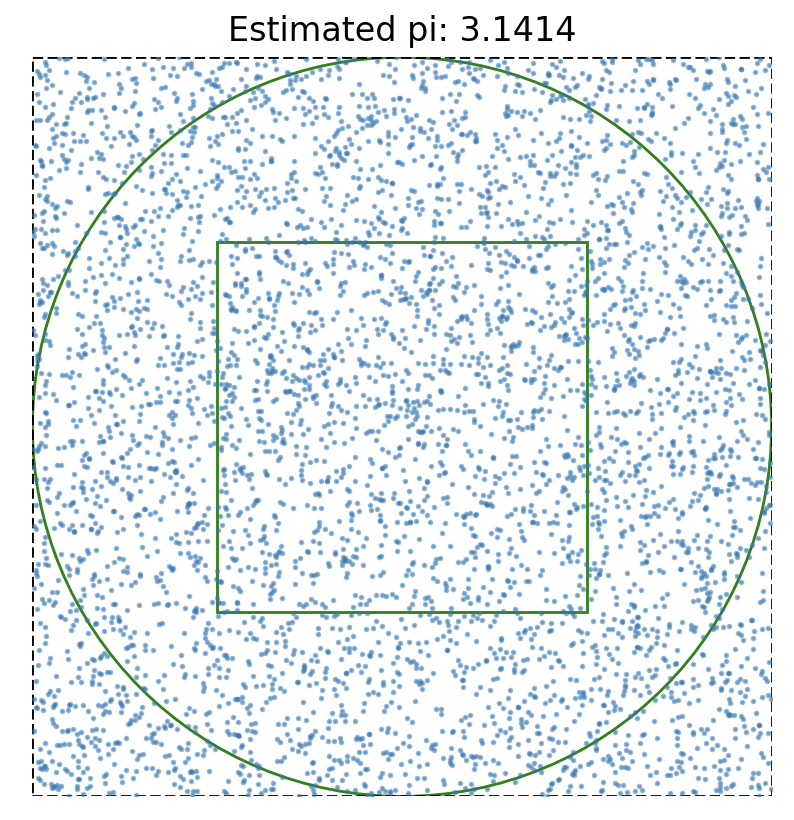

# Pi Calculators

## Polygon Perimeter Method

The script `pi_perimeter.py` can be used to approximate the value of Pi using the polygon perimeter method. A polygon of a (provided) number of sides is drawn within and around the circle. The perimeter of the polygon provides an upper and lower bound on the circumference of the circle which in-turn provides an upper and lower bound on the value of Pi. The higher the polygon count, the closer the approximation to Pi. The script provides various parameters to plot and report the level of precision achieved.

## Monte Carlo Method

The script `pi_mcmc.py` can be used to approximate the value of Pi using the Monte Carlo method. A number of random points are generated that fall within a square or a circle. The ratio of points that fall within the circle to the number of points in the square provides an approximation of Pi. The script provides various parameters to plot and report the level of precision achieved.

