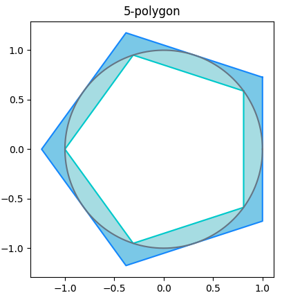

# Pi Calculator

The script `pi_calc.py` can be used to approximate the value of Pi using the polygon perimeter method. A polygon of a (provided) number of sides is drawn within and around the circle. The perimeter of the polygon provides an upper and lower bound on the circumference of the circle which in-turn provides an upper and lower bound on the value of Pi. The higher the polygon count, the closer the approximation to Pi. The script provides various parameters to plot and report the level of precision achieved.

